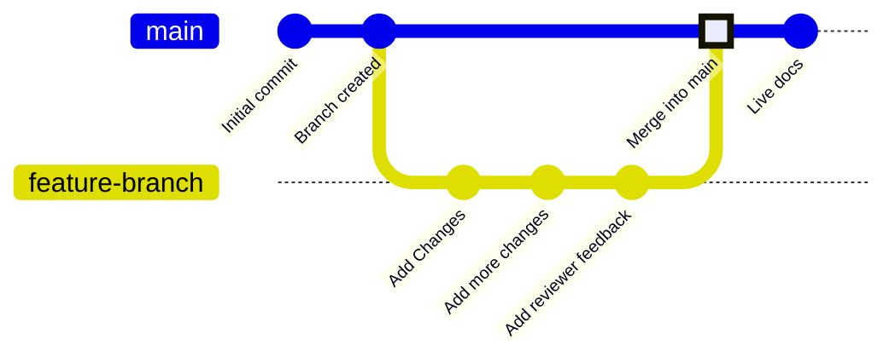

Las ramas son una función del control de versiones que apuntan a commits específicos de tu repositorio. Tu rama de despliegue, normalmente llamada `main`, representa el contenido que se utiliza para compilar tu sitio de documentación en producción. Todas las demás ramas son independientes de la documentación publicada, a menos que decidas fusionarlas en tu rama de despliegue.

Las ramas te permiten crear versiones independientes de tu documentación para hacer cambios, obtener revisiones y probar nuevos enfoques antes de publicar. Tu equipo puede trabajar en ramas para actualizar distintas partes de la documentación al mismo tiempo sin afectar lo que ven los usuarios en tu sitio en producción.

El siguiente diagrama muestra un ejemplo de un flujo de trabajo con ramas en el que se crea una rama de funcionalidad, se realizan cambios y luego esa rama se fusiona con la rama main.



Recomendamos trabajar siempre en ramas al actualizar la documentación para mantener estable tu sitio en producción y facilitar los flujos de trabajo de revisión.

<div id="branch-naming-conventions">
  ## Convenciones para nombrar ramas
</div>

Usa nombres claros y descriptivos que expliquen el propósito de la rama.

**Usa**:

* `fix-broken-links`
* `add-webhooks-guide`
* `reorganize-getting-started`
* `ticket-123-oauth-guide`

**Evita**:

* `temp`
* `my-branch`
* `updates`
* `branch1`

<div id="create-a-branch">
  ## Crear una rama
</div>

<Tabs>
  <Tab title="Usando el editor web">
    1. Haz clic en el nombre de la rama en la barra de herramientas del editor.
    2. Haz clic en **Create new branch**.
    3. Introduce un nombre descriptivo.
    4. Si tienes cambios sin guardar, elige si quieres llevarlos a la nueva rama o dejarlos en la rama actual.
    5. Haz clic en **Create branch**.
  </Tab>

  <Tab title="Usando desarrollo local">
    <Steps>
      <Step title="Crea una rama desde la terminal">
        ```bash
        git checkout -b branch-name
        ```

        Esto crea la rama y cambia a ella en un solo comando.
      </Step>

      <Step title="Sube la rama a GitHub">
        ```bash
        git push -u origin branch-name
        ```

        La opción `-u` configura el seguimiento para que en los próximos envíos solo necesites `git push`.
      </Step>
    </Steps>
  </Tab>
</Tabs>

<div id="save-changes-on-a-branch">
  ## Guarda los cambios en una rama
</div>

<Tabs>
  <Tab title="Con el editor web">
    Selecciona el botón **Save as commit** en la esquina superior derecha de la barra de herramientas del editor. Esto crea un commit y sube tu trabajo a tu rama automáticamente.
  </Tab>

  <Tab title="Con desarrollo local">
    Prepara, haz commit y sube tus cambios.

    ```bash
    git add .
    git commit -m "Describe your changes"
    git push
    ```
  </Tab>
</Tabs>

<div id="switch-branches">
  ## Cambiar de rama
</div>

<Tabs>
  <Tab title="Usar el editor web">
    1. Haz clic en el nombre de la rama en la barra de herramientas del editor para abrir el menú desplegable de ramas.
    2. Busca una rama por su nombre o desplázate por la lista.
    3. Haz clic en la rama a la que quieres cambiar.

    Cada rama del menú desplegable muestra un indicador de estado para que puedas ver si está lista, en sincronización o si falló.

    <Warning>
      Los cambios no guardados se pierden al cambiar de rama. Guarda tu trabajo primero.
    </Warning>
  </Tab>

  <Tab title="Usar desarrollo local">
    Cambia a una rama existente:

    ```bash
    git checkout branch-name
    ```

    O créala y cámbiate a ella con un solo comando:

    ```bash
    git checkout -b new-branch-name
    ```
  </Tab>
</Tabs>

<div id="merge-branches">
  ## Fusionar ramas
</div>

Cuando tus cambios estén listos para publicarse, crea una solicitud de extracción (pull request, PR) para fusionar tu rama con la rama de despliegue. 