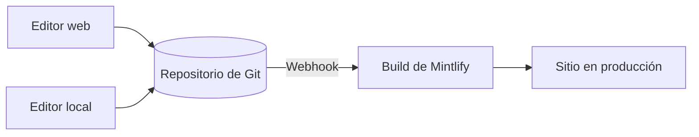

Mintlify aloja tu contenido como un sitio web. Tu contenido se guarda en un repositorio de Git en forma de archivos MDX, y Mintlify compila y despliega tu sitio automáticamente cuando subes un cambio.

  ## Las tres partes de un proyecto de Mintlify

**Tu repositorio** es la fuente de referencia de tu documentación. Contiene un archivo MDX para cada página y un archivo `docs.json` que configura la navegación, el tema y la configuración de tu sitio. Puedes usar tu propio repositorio de GitHub o GitLab, o dejar que Mintlify cree uno por ti durante la configuración inicial.

**El panel de Mintlify** se conecta a tu repositorio y te permite administrar tu sitio. Úsalo para supervisar los despliegues, configurar opciones, gestionar tu equipo y editar contenido directamente en el navegador.

**Tu sitio**, con tecnología de Mintlify. Mintlify compila tu sitio a partir de tu repositorio y, de forma predeterminada, lo despliega en una URL de `.mintlify.app`. Cuando estés listo, puedes apuntar un dominio personalizado a tu sitio.

  ## Edición de contenido

Hay dos formas de editar tu contenido y puedes cambiar entre ellas libremente.

* **Editor web**: Edita y publica páginas desde tu navegador. El editor hace commit de los cambios en tu repositorio de Git automáticamente.
* **CLI y editor local**: Clona tu repositorio, ejecuta `mint dev` para previsualizar tu sitio localmente y luego haz push de los cambios para desplegarlos.

Varios miembros del equipo pueden trabajar en cualquiera de los dos flujos de trabajo al mismo tiempo, usando ramas de Git para gestionar cambios en paralelo. Cualquiera que pueda hacer push a tu repositorio puede actualizar tu contenido.

  ## Funciones de IA

Las funciones de IA integradas ayudan a las personas y a la IA a encontrar y comprender tu contenido, y también te ayudan a mantenerlo.

El **asistente** permite a tus usuarios hacer preguntas y obtener respuestas con citas basadas en tu contenido.

El **agente** ayuda a tu equipo a crear y mantener contenido al generar actualizaciones a partir de flujos de trabajo programados, solicitudes de extracción (pull request, PR) fusionadas en tu repositorio de funcionalidades o hilos de Slack.

Consulta [documentación nativa para IA](/es/ai-native) para ver un resumen de todas las funciones de IA.

  ## Siguientes pasos

<Card title="Inicio rápido" icon="rocket" horizontal href="/es/quickstart">
  Despliega tu primer sitio de documentación en minutos.
</Card>