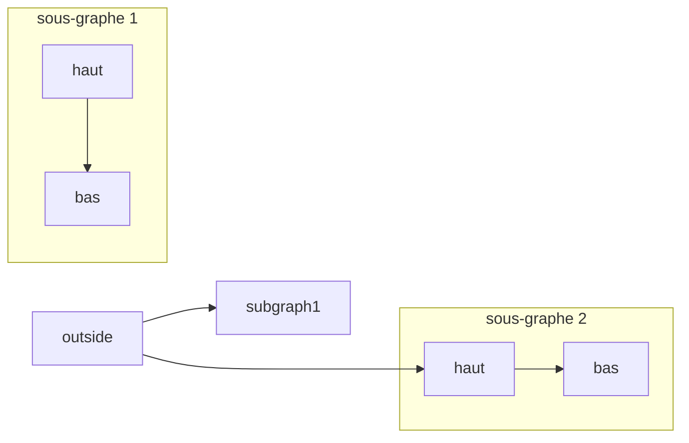
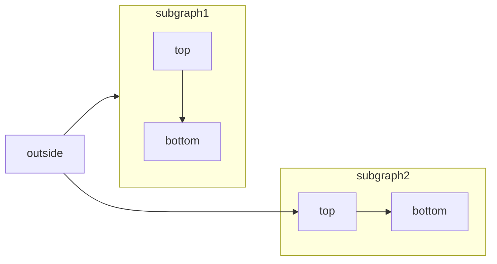
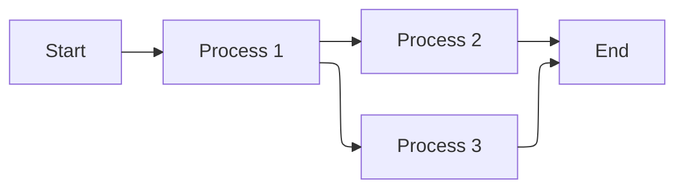
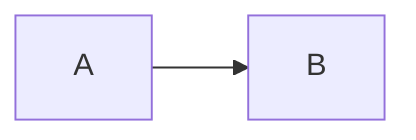

[Mermaid](https://mermaid.js.org/) vous permet de créer des diagrammes de flux, des diagrammes de séquence, des diagrammes de Gantt et d&#39;autres diagrammes à l&#39;aide de texte et de code.

Pour obtenir la liste complète des types de diagrammes pris en charge et de leur syntaxe, consultez la [documentation Mermaid](https://mermaid.js.org/intro/).



````mdx Mermaid flowchart example

````

<div id="elk-layout-support">
  ## Prise en charge de la mise en page ELK
</div>

Mintlify prend en charge le moteur de mise en page [ELK (Eclipse Layout Kernel)](https://www.eclipse.org/elk/) pour les diagrammes Mermaid. ELK optimise l’agencement afin de réduire les chevauchements et d’améliorer la lisibilité, ce qui est particulièrement utile pour les diagrammes volumineux ou complexes.

Pour utiliser la mise en page ELK dans vos diagrammes Mermaid, ajoutez la directive `%%{init: {'flowchart': {'defaultRenderer': 'elk'}}}%%` au début de votre diagramme :

````mdx ELK layout example

````

<div id="interactive-controls">
  ## Contrôles interactifs
</div>

Tous les diagrammes Mermaid incluent des contrôles interactifs de zoom et de déplacement. Par défaut, ces contrôles s’affichent lorsque la hauteur du diagramme dépasse 120px.

* **Zoom avant/arrière**: utilisez les boutons de zoom pour agrandir ou réduire l’échelle du diagramme.
* **Déplacement**: utilisez les flèches directionnelles pour vous déplacer dans le diagramme.
* **Réinitialiser la vue**: cliquez sur le bouton de réinitialisation pour revenir à la vue d’origine.

Ces contrôles sont particulièrement utiles pour les diagrammes volumineux ou complexes qui ne tiennent pas entièrement dans la zone d’affichage.

<div id="properties">
  ## Propriétés
</div>

<ResponseField name="actions" type="boolean">
  Affiche ou masque les contrôles interactifs. Lorsqu’elle est définie, cette option remplace le comportement par défaut (les contrôles s’affichent lorsque la hauteur du diagramme dépasse 120px).
</ResponseField>

<ResponseField name="placement" type="string" default="bottom-right">
  Position des contrôles interactifs. Options : `top-left`, `top-right`, `bottom-left`, `bottom-right`.
</ResponseField>

<div id="examples">
  ### Exemples
</div>

Masquez les contrôles d’un diagramme :

````mdx

````

Affichez les contrôles dans le coin supérieur gauche :

````mdx

````

Combinez les deux propriétés :

````mdx

````

<div id="syntax">
  ## Syntaxe
</div>

Pour créer un diagramme Mermaid, écrivez sa définition dans un bloc de code Mermaid.

````mdx
```mermaid
// Votre code de diagramme Mermaid ici
```
````