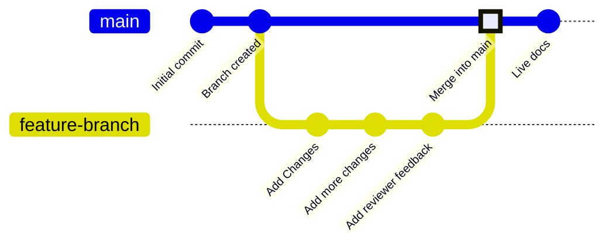

Les branches sont une fonctionnalité du contrôle de version qui point vers des commits spécifiques dans votre dépôt. Votre branche de déploiement, généralement appelée `main`, correspond au contenu utilisé pour générer votre site de documentation en production. Toutes les autres branches sont indépendantes de votre documentation en production, sauf si vous choisissez de les fusionner dans votre branche de déploiement.

Les branches vous permettent de créer des versions distinctes de votre documentation afin d’apporter des modifications, d’obtenir des retours et d’essayer de nouvelles approches avant la publication. Votre équipe peut travailler sur des branches pour mettre à jour simultanément différentes parties de votre documentation sans affecter ce que les utilisateurs voient sur votre site en production.

Le schéma suivant montre un exemple de flux de travail avec des branches, dans lequel une branche de fonctionnalité est créée, des modifications sont apportées, puis la branche de fonctionnalité est fusionnée dans la branche principale.



Nous vous recommandons de toujours travailler sur des branches lorsque vous mettez à jour la documentation, afin de préserver la stabilité de votre site publié et de permettre des flux de travail de révision.

<div id="branch-naming-conventions">
  ## Conventions de nommage des branches
</div>

Utilisez des noms clairs et explicites qui indiquent l’objectif de la branche.

**À utiliser** :

* `fix-broken-links`
* `add-webhooks-guide`
* `reorganize-getting-started`
* `ticket-123-oauth-guide`

**À éviter** :

* `temp`
* `my-branch`
* `updates`
* `branch1`

<div id="create-a-branch">
  ## Créer une branche
</div>

<Tabs>
  <Tab title="Avec l’éditeur web">
    1. Cliquez sur le nom de la branche dans la barre d’outils de l’éditeur.
    2. Cliquez sur **Create new branch**.
    3. Saisissez un nom explicite.
    4. Si vous avez des modifications non enregistrées, choisissez de les transférer vers la nouvelle branche ou de les laisser sur votre branche actuelle.
    5. Cliquez sur **Create branch**.
  </Tab>

  <Tab title="En développement local">
    <Steps>
      <Step title="Créer une branche depuis le terminal">
        ```bash
        git checkout -b branch-name
        ```

        Cette commande crée la branche et bascule dessus en une seule fois.
      </Step>

      <Step title="Pousser la branche vers GitHub">
        ```bash
        git push -u origin branch-name
        ```

        L’option `-u` configure le suivi, afin que les prochains envois ne nécessitent qu’un `git push`.
      </Step>
    </Steps>
  </Tab>
</Tabs>

<div id="save-changes-on-a-branch">
  ## Enregistrez les modifications sur une branche
</div>

<Tabs>
  <Tab title="Avec l’éditeur web">
    Cliquez sur le bouton **Save as commit** en haut à droite de la barre d’outils de l’éditeur. Cela crée un commit et pousse automatiquement votre travail vers votre branche.
  </Tab>

  <Tab title="Avec le développement local">
    Ajoutez, validez et poussez vos modifications.

    ```bash
    git add .
    git commit -m "Describe your changes"
    git push
    ```
  </Tab>
</Tabs>

<div id="switch-branches">
  ## Changer de branche
</div>

<Tabs>
  <Tab title="Avec l’éditeur web">
    1. Cliquez sur le nom de la branche dans la barre d’outils de l’éditeur pour ouvrir le menu déroulant des branches.
    2. Recherchez une branche par son nom ou faites défiler la liste.
    3. Cliquez sur la branche vers laquelle vous voulez basculer.

    Dans le menu déroulant, chaque branche affiche un indicateur d’état pour vous permettre de voir si elle est prête, en cours de synchronisation ou en échec.

    <Warning>
      Les modifications non enregistrées sont perdues lorsque vous changez de branche. Enregistrez d’abord votre travail.
    </Warning>
  </Tab>

  <Tab title="En développement local">
    Basculez vers une branche existante :

    ```bash
    git checkout branch-name
    ```

    Ou créez-en une et basculez-y en une seule commande :

    ```bash
    git checkout -b new-branch-name
    ```
  </Tab>
</Tabs>

<div id="merge-branches">
  ## Fusionner les branches
</div>

Une fois vos modifications prêtes à être publiées, créez une pull request (PR) afin de fusionner votre branche avec la branche de déploiement. 