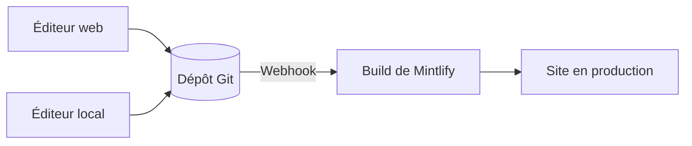

Mintlify héberge votre contenu sous forme de site web. Votre contenu est stocké dans un dépôt Git sous forme de fichiers MDX, et Mintlify génère et déploie automatiquement votre site lorsque vous poussez une modification.

  ## Les trois parties d’un projet Mintlify

**Votre dépôt** est la source de référence de votre documentation. Il contient un fichier MDX pour chaque page et un fichier `docs.json` qui configure la navigation, le thème et les paramètres de votre site. Vous pouvez utiliser votre propre dépôt GitHub ou GitLab, ou laisser Mintlify en créer un pour vous lors de l’onboarding.

**Le tableau de bord Mintlify** se connecte à votre dépôt et vous permet de gérer votre site. Utilisez-le pour suivre les déploiements, configurer les paramètres, gérer votre équipe et modifier le contenu directement dans le navigateur.

**Votre site**, propulsé par Mintlify. Mintlify génère votre site à partir de votre dépôt et le déploie par défaut à une URL en `.mintlify.app`. Lorsque vous êtes prêt, vous pouvez faire pointer un domaine personnalisé vers votre site.

  ## Modification du contenu

Il existe deux façons de modifier votre contenu, et vous pouvez passer librement de l’une à l’autre.

* **Éditeur web** : Modifiez et publiez des pages dans votre navigateur. L’éditeur crée automatiquement un commit des modifications dans votre dépôt Git.
* **CLI et éditeur local** : Clonez votre dépôt, exécutez `mint dev` pour prévisualiser votre site en local, puis poussez vos modifications pour les déployer.

Plusieurs membres de l’équipe peuvent travailler simultanément avec l’une ou l’autre méthode, en utilisant des branches Git pour gérer des modifications en parallèle. Toute personne autorisée à pousser vers votre dépôt peut mettre à jour votre contenu.

  ## Fonctionnalités d’IA

Les fonctionnalités d’IA intégrées aident les utilisateurs et les IA à trouver et à comprendre votre contenu, et vous aident à le maintenir à jour.

L’**assistant** permet à vos utilisateurs de poser des questions et d’obtenir des réponses accompagnées de citations provenant de votre contenu.

L’**agent** aide votre équipe à créer et à maintenir du contenu en générant des mises à jour à partir de flux de travail planifiés, de pull requests (PR) fusionnées dans votre dépôt de fonctionnalités ou de fils de discussion Slack.

Consultez la page [documentation native pour l’IA](/fr/ai-native) pour une vue d’ensemble de toutes les fonctionnalités d’IA.

  ## Prochaines étapes

<Card title="Démarrage rapide" icon="rocket" horizontal href="/fr/quickstart">
  Déployez votre premier site de documentation en quelques minutes.
</Card>