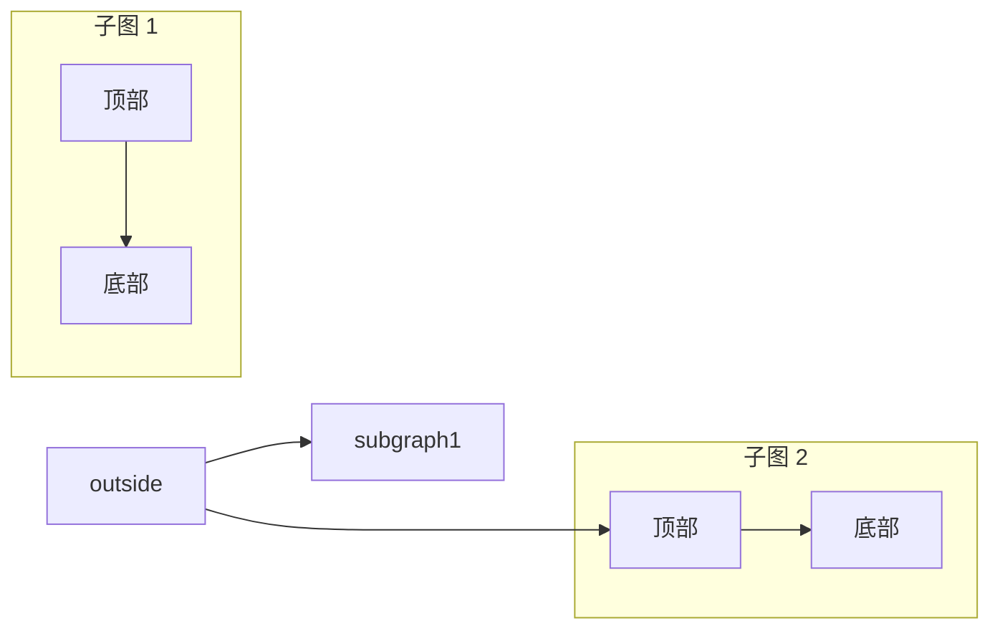
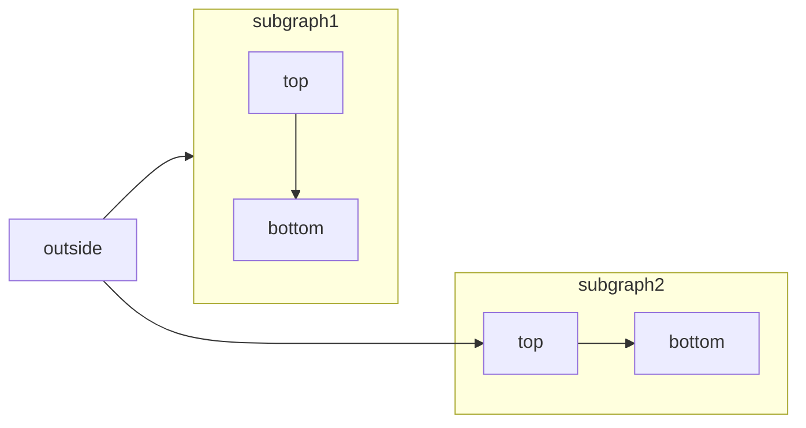
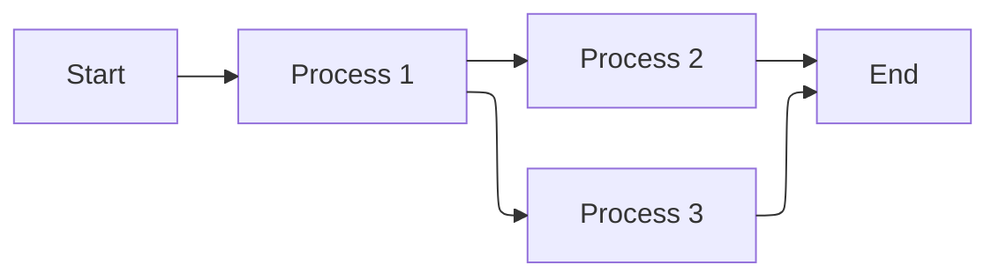
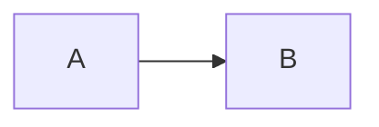

[Mermaid](https://mermaid.js.org/) 可让你通过文本和代码创建流程图、时序图、甘特图及其他图表。

如需查看支持的所有图表类型及其语法，请参阅 [Mermaid 文档](https://mermaid.js.org/intro/)。



````mdx Mermaid flowchart example

````

<div id="elk-layout-support">
  ## ELK 布局支持
</div>

Mintlify 支持在 Mermaid 图中使用 [ELK (Eclipse Layout Kernel)](https://www.eclipse.org/elk/) 布局引擎。ELK 可优化图形布局，减少重叠并提升可读性，因此尤其适合大型或复杂的图表。

要在 Mermaid 图中使用 ELK 布局，请在图表开头添加 `%%{init: {'flowchart': {'defaultRenderer': 'elk'}}}%%` 指令：

````mdx ELK layout example

````

<div id="interactive-controls">
  ## 交互控件
</div>

所有 Mermaid 图表都包含可交互的缩放和平移控件。默认情况下，当图表高度超过 120px 时，会显示这些控件。

* **放大/缩小**：使用缩放按钮可放大或缩小图表。
* **平移**：使用方向箭头在图表中四处移动。
* **重置视图**：点击重置按钮可恢复到初始视图。

对于无法在视口中完整显示的大型或复杂图表，这些控件尤其有用。

<div id="properties">
  ## 属性
</div>

<ResponseField name="actions" type="boolean">
  显示或隐藏交互控件。设置后，将覆盖默认行为 (默认情况下，当图表高度超过 120px 时显示控件) 。
</ResponseField>

<ResponseField name="placement" type="string" default="bottom-right">
  交互控件的位置。可选项：`top-left`、`top-right`、`bottom-left`、`bottom-right`。
</ResponseField>

<div id="examples">
  ### 示例
</div>

隐藏图表中的控件：

````mdx

````

在左上角显示控件：

````mdx

````

将这两个属性结合起来：

````mdx

````

<div id="syntax">
  ## 语法
</div>

要创建 Mermaid 图表，请在 Mermaid 代码块中编写图表定义。

````mdx
```mermaid
// 在此处填写您的 Mermaid 图表代码
```
````