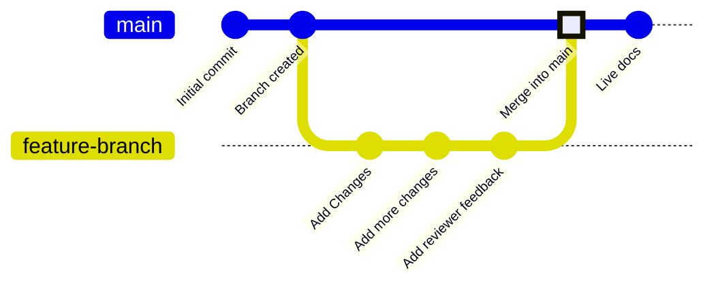

分支是版本控制中的一项功能，用于指向仓库中的特定提交。你的部署分支通常名为 `main`，它代表用于构建线上文档站点的内容。除非你选择将其他分支合并到部署分支中，否则它们都不会影响你的线上文档。

分支让你可以为文档创建彼此独立的版本，以便在发布前进行修改、获取评审反馈并尝试新方案。你的团队可以同时在不同分支上更新文档的不同部分，而不会影响用户在线上站点中看到的内容。

下图展示了一个分支工作流示例：先创建一个功能分支，进行修改，然后将该功能分支合并到 `main` 分支中。



我们建议始终通过分支更新文档，以保持线上站点稳定，并支持审核工作流。

<div id="branch-naming-conventions">
  ## 分支命名规范
</div>

使用清晰、具有描述性的名称，让人一眼就能看出分支的用途。

**使用**：

* `fix-broken-links`
* `add-webhooks-guide`
* `reorganize-getting-started`
* `ticket-123-oauth-guide`

**避免**：

* `temp`
* `my-branch`
* `updates`
* `branch1`

<div id="create-a-branch">
  ## 创建分支
</div>

<Tabs>
  <Tab title="使用网页编辑器">
    1. 点击编辑器工具栏中的分支名称。
    2. 点击 **Create new branch**。
    3. 输入一个便于识别的名称。
    4. 如果你有未保存的更改，请选择是将这些更改带到新分支，还是保留在当前分支。
    5. 点击 **Create branch**。
  </Tab>

  <Tab title="使用本地开发">
    <Steps>
      <Step title="在终端中创建分支">
        ```bash
        git checkout -b branch-name
        ```

        这条命令会在创建分支的同时切换到该分支。
      </Step>

      <Step title="将分支推送到 GitHub">
        ```bash
        git push -u origin branch-name
        ```

        `-u` 标志会设置跟踪关系，这样以后推送时只需运行 `git push`。
      </Step>
    </Steps>
  </Tab>
</Tabs>

<div id="save-changes-on-a-branch">
  ## 将更改保存到分支
</div>

<Tabs>
  <Tab title="使用网页编辑器">
    选择编辑器工具栏右上角的 **Save as commit** 按钮。这会创建一个提交，并自动将你的更改推送到当前分支。
  </Tab>

  <Tab title="使用本地开发">
    暂存、提交并推送你的更改。

    ```bash
    git add .
    git commit -m "Describe your changes"
    git push
    ```
  </Tab>
</Tabs>

<div id="switch-branches">
  ## 切换分支
</div>

<Tabs>
  <Tab title="使用网页编辑器">
    1. 点击编辑器工具栏中的分支名称，打开分支下拉菜单。
    2. 按名称搜索分支，或滚动查看列表。
    3. 点击要切换到的分支。

    下拉菜单中的每个分支都会显示状态指示，方便你查看该分支是否已就绪、正在同步或同步失败。

    <Warning>
      切换分支时，未保存的更改会丢失。请先保存你的工作。
    </Warning>
  </Tab>

  <Tab title="使用本地开发">
    切换到现有分支：

    ```bash
    git checkout branch-name
    ```

    或者用一条命令创建并切换到新分支：

    ```bash
    git checkout -b new-branch-name
    ```
  </Tab>
</Tabs>

<div id="merge-branches">
  ## 合并分支
</div>

更改准备好发布后，创建一个拉取请求 (PR) ，将你的分支合并到部署分支中。 