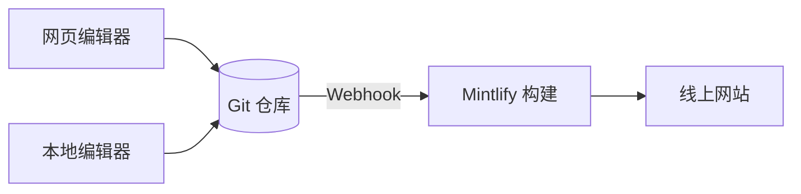

Mintlify 会将你的内容托管并发布为网站。你的内容以 MDX 文件的形式存放在 Git 仓库中，当你推送更改时，Mintlify 会自动构建并部署你的网站。

  ## Mintlify 项目的三个组成部分

**你的代码仓库**是文档的唯一真实来源。其中每个页面都对应一个 MDX 文件，此外还有一个 `docs.json` 文件，用于配置站点的导航、主题和其他设置。你可以使用自己的 GitHub 或 GitLab 代码仓库，也可以在初始设置过程中让 Mintlify 为你创建一个。

**Mintlify 仪表板**会连接到你的代码仓库，让你管理站点。你可以用它监控部署、配置设置、管理团队，并直接在浏览器中编辑内容。

**你的站点**由 Mintlify 提供支持。Mintlify 会根据你的代码仓库构建站点，并默认将其部署到 `.mintlify.app` URL。准备就绪后，你可以将自定义域名指向你的站点。

  ## 编辑内容

你可以通过两种方式编辑内容，并且可以在两者之间自由切换。

* **网页编辑器**：在浏览器中编辑并发布页面。编辑器会自动将更改提交回你的 Git 仓库。
* **CLI 和本地编辑器**：克隆你的仓库，运行 `mint dev` 在本地预览站点，然后推送更改进行部署。

多个团队成员可以同时使用任一工作流，并通过 Git 分支管理并行进行的更改。任何有权限向你的仓库推送内容的人都可以更新内容。

  ## AI 功能

内置 AI 功能可帮助用户和 AI 查找并理解您的内容，也可帮助您维护这些内容。

**助手**让用户能够提问，并从您的内容中获得带引用的答案。

**智能体**可根据计划工作流、功能仓库中已合并的拉取请求 (PR) 或 Slack 讨论串生成更新，帮助您的团队创建和维护内容。

有关所有 AI 功能的概览，请参阅 [AI 原生文档](/zh/ai-native)。

  ## 下一步

<Card title="快速开始" icon="rocket" horizontal href="/zh/quickstart">
  只需几分钟，即可部署您的第一个文档站点。
</Card>